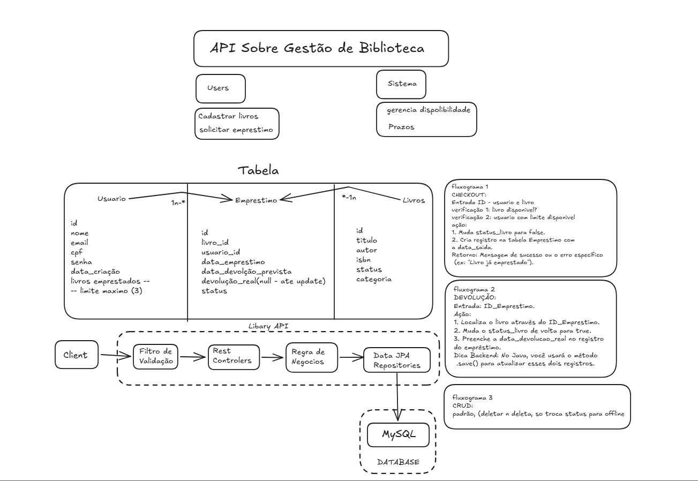
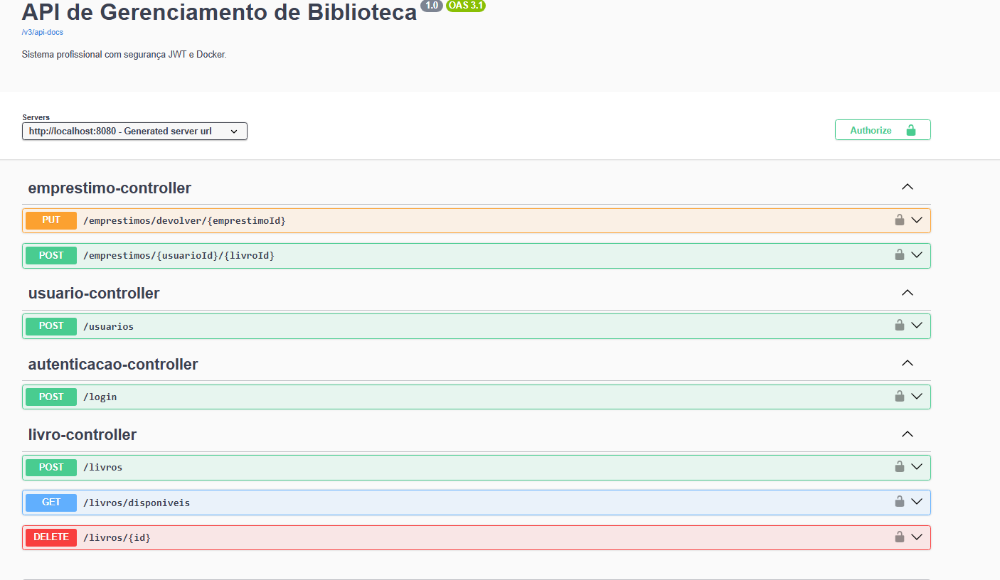
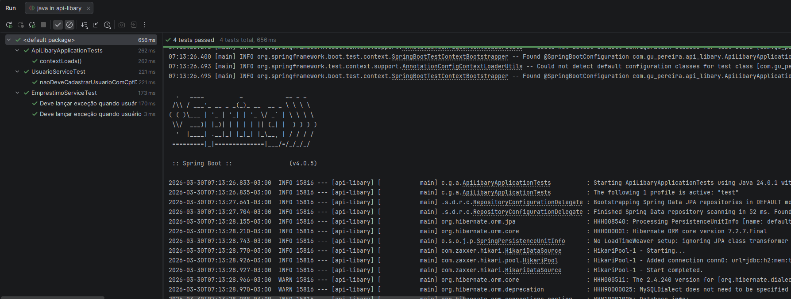

# 📚 Library API Management System


Sistema de backend profissional para gerenciamento de bibliotecas, desenvolvido com **Java 21** e **Spring Boot 3**. O projeto implementa regras de negócio complexas, segurança robusta com JWT e está totalmente preparado para escala com Docker.

---

## 🏗️ Arquitetura do Sistema

O projeto foi desenhado seguindo padrões modernos de desenvolvimento, garantindo desacoplamento e segurança em todas as camadas.

### ⚙️ Arquitetura Técnica
Visão do fluxo da requisição, desde o cliente até a persistência no banco de dados, orquestrada por containers Docker.



---

## 🚀 Funcionalidades Principais

### 🔐 Segurança
* **Autenticação Stateless**: Implementação de JWT (JSON Web Token) para controle de sessão.
* **Proteção de Camada**: Filtro customizado para validação de token em todas as rotas protegidas.
* **Criptografia**: Senhas de usuários são protegidas com algoritmos de Hash BCrypt.

### ⚖️ Regras de Negócio
* **Limite de Empréstimos**: Trava de segurança que impede um usuário de ter mais de 3 livros simultaneamente.
* **Gestão de Multas**: Cálculo automático de taxas por atraso na devolução.
* **Bloqueio de Inadimplentes**: Usuários com multas pendentes são impedidos de realizar novos empréstimos.

---

## 📊 Visualização e Testes

### Documentação Interativa (Swagger)
Interface para testes de endpoints com suporte nativo a Bearer Authentication (JWT).


### Garantia de Qualidade (Testes Unitários)
Suíte de testes automatizados garantindo a integridade da lógica de negócio e regras de validação.


---

## 🐳 Como Executar

O projeto utiliza **Docker Compose** para configurar todo o ambiente (API + Banco de Dados) com um único comando.

1.  **Clone o repositório**:
    ```bash
    git clone [https://github.com/gu-pereira/api-libary.git](https://github.com/gu-pereira/api-libary.git)
    cd api-libary
    ```

2.  **Suba os containers**:
    ```bash
    docker-compose up --build
    ```

3.  **Acesse a documentação**:
    Abra `http://localhost:8080/swagger-ui/index.html` para testar os endpoints.

---

## 🛠️ Tecnologias Utilizadas
* **Java 21** & **Spring Boot 3**
* **Spring Security** & **JWT**
* **Spring Data JPA** & **MySQL**
* **Docker** & **Docker Compose**
* **JUnit 5** & **Mockito**
* **Swagger (OpenAPI 3)**